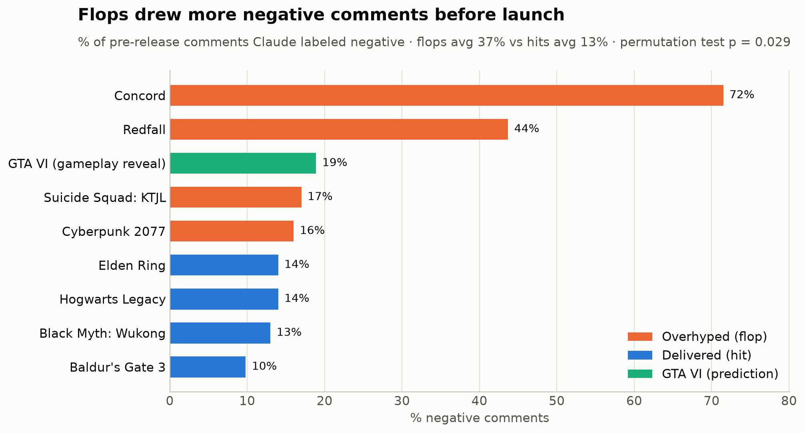
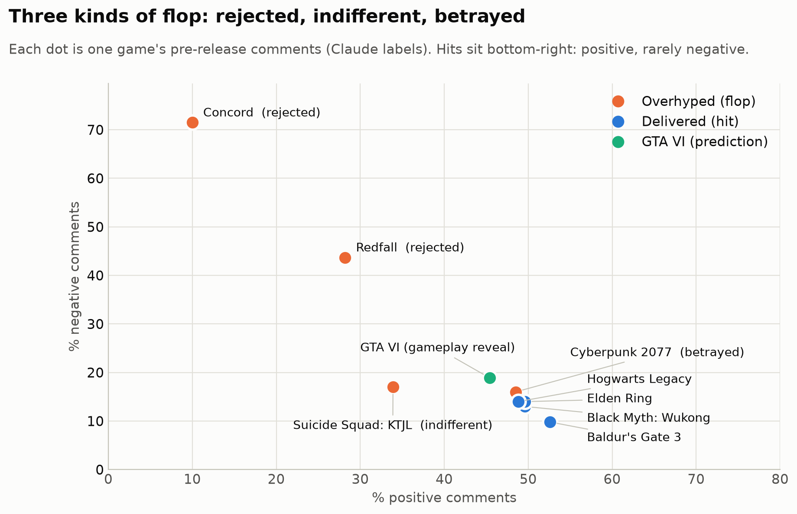
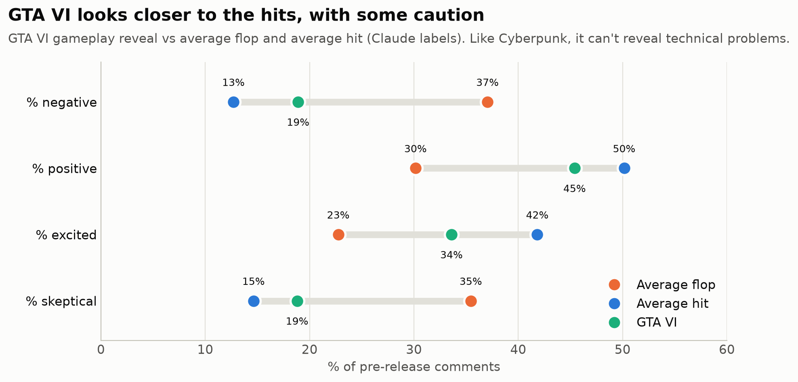
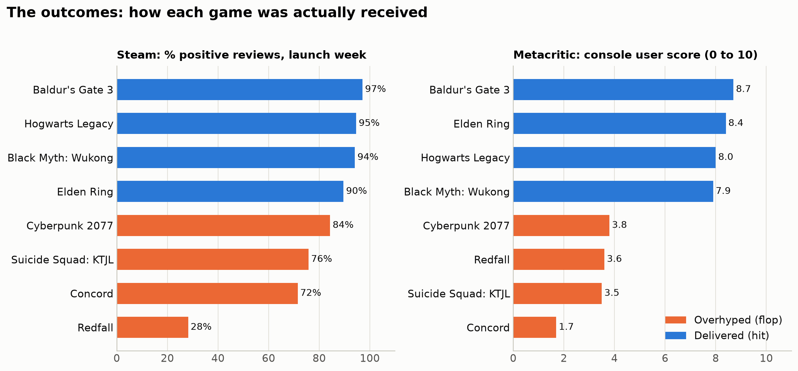
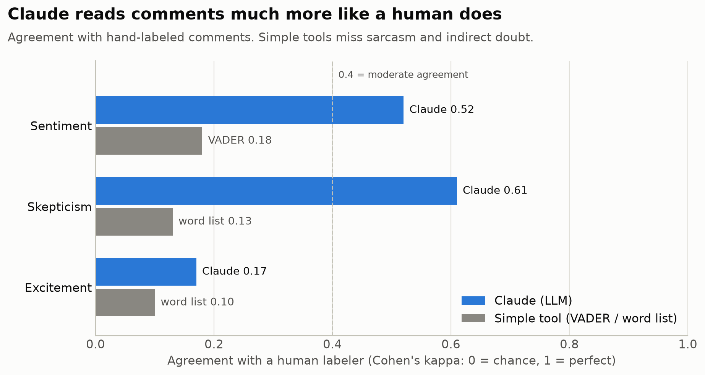

# Hype or Hit? Predicting Game Launch Disappointment from Pre-Release Chatter

Can YouTube comments posted **before** a game launches tell genuine excitement apart from hype that is headed for a letdown?

I analyzed **~24,000 pre-release YouTube comments** across 8 major game launches (4 flops, 4 hits), labeled them with an LLM (Claude Haiku), validated those labels against human judgment, and used the patterns to make a prediction for **GTA VI** (releasing Nov 19, 2026).



## Key findings

1. **Flops drew far more negative comments before launch.** 37% of pre-release comments were negative for flops vs 13% for hits. All 4 flops ranked above all 4 hits (exact permutation test, p = 0.029, the strongest result possible with 8 games).
2. **Flops were also less positive** (30% vs 50%, p = 0.029), less excited and more skeptical (suggestive, p = 0.06 to 0.09).
3. **There are three kinds of flop.** Two are visible in chatter, one is not:
   - **Rejected** (Concord, Redfall): audiences turned against the game before launch
   - **Indifferent** (Suicide Squad: KTJL): not hated, just no enthusiasm
   - **Betrayed** (Cyberpunk 2077): pre-release chatter looked like a hit; the failure was technical (console bugs) and invisible in trailers
4. **Simple text tools are unreliable on YouTube comments.** On hand-labeled comments, Claude agreed with a human far better than dictionary methods (sentiment kappa 0.52 vs 0.18 for VADER; skepticism 0.61 vs 0.13 for a word list), mainly because of sarcasm and indirect doubt.
5. **GTA VI prediction:** its gameplay reveal looks much closer to the hits than the flops, with slightly lower excitement and slightly higher skepticism than any hit. Its profile is closest to Cyberpunk's, so chatter cannot rule out a technical letdown.





## The games

| Group | Games | How "flop" was confirmed |
|---|---|---|
| Overhyped | Cyberpunk 2077, Concord, Suicide Squad: KTJL, Redfall | Metacritic console user scores of 1.7 to 3.8, low Steam reviews or player collapse |
| Delivered | Elden Ring, Baldur's Gate 3, Black Myth: Wukong, Hogwarts Legacy | Metacritic console user scores of 7.9 to 8.7, 90%+ positive on Steam |
| Prediction | GTA VI | Outcome unknown at time of analysis |



## Method

| Step | Script | What it does |
|---|---|---|
| 1 | `01_find_trailers.py` | Finds official trailers uploaded before each release (YouTube Data API) |
| 2 | `02_collect_comments.py` | Downloads top-level comments, flags pre/post release and comments edited after launch |
| 3 | `03_collect_steam.py` | Steam launch-week and all-time review scores, monthly history, launch reviews |
| 4 | `04_build_dataset.py` | Cleans text, filters non-English, short and duplicate comments, samples up to 3,000 per game |
| 5 | `05_text_features.py` | VADER sentiment, hype and skepticism word lists, distinctive words (lift) |
| 6 | `06_topics.py` | LDA topic modeling, learned on the 8 known games and applied to GTA VI |
| 7 | `07_stats.py` | Confidence intervals and exact permutation tests (unit of analysis = game) |
| 8 | `08_llm_validate.py` | Blind labeling of every comment with Claude Haiku (no game names or outcomes shown) |
| 9 | `09_human_check.py` | Human gold-standard check of Claude vs VADER and word lists |
| 10 | `10_charts.py` | Presentation charts |

**Key design choices**
- **No data leakage:** only comments posted before launch are used, and comments edited after launch are excluded (some added "this aged badly").
- **Blind LLM labeling:** Claude never saw game names or outcomes, and batches mixed games together.
- **Triangulation:** word lists, VADER, topic modeling and Claude were compared; only findings that held across methods are reported as strong.
- **Honest statistics:** with 8 games, an exact permutation test over all 70 possible 4/4 splits is used instead of tests that assume large samples.



## Limitations

- **Only 8 games.** Results are strong patterns, not proof.
- **Genre confound:** 3 of 4 flops are live-service shooters and all hits are single-player RPGs, so some word differences reflect genre.
- **Like counts and Metacritic scores are current values,** not values at launch time.
- **Human validation used one labeler** and a small sample (38 comments).
- **The LLM may recognize famous games** from their content even without names.
- **Chatter cannot detect technical problems** (the Cyberpunk case).

## Reproduce it

```bash
pip install -r requirements.txt
```

Create a `.env` file:
```text
YOUTUBE_API_KEY=your_key
ANTHROPIC_API_KEY=your_key
ANTHROPIC_MODEL=claude-haiku-4-5
```

Then run the scripts in order (`python scripts/01_find_trailers.py` and so on). Raw comments are not included in this repo; the Claude labels (`data/processed/llm_labels.csv`) are, so the LLM step does not need to be re-run. Full LLM labeling cost about $7 with Claude Haiku 4.5.

## Tools

Python, pandas, YouTube Data API v3, Steam store API, VADER, scikit-learn (LDA, Cohen's kappa), Anthropic Claude API, matplotlib.

## License

Code is released under the [MIT License](LICENSE). You're free to use and adapt it, with credit.
If this project helped you, a link back to this repo is appreciated.